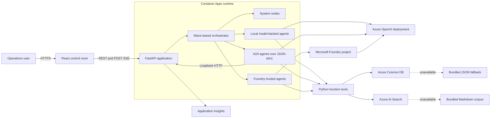
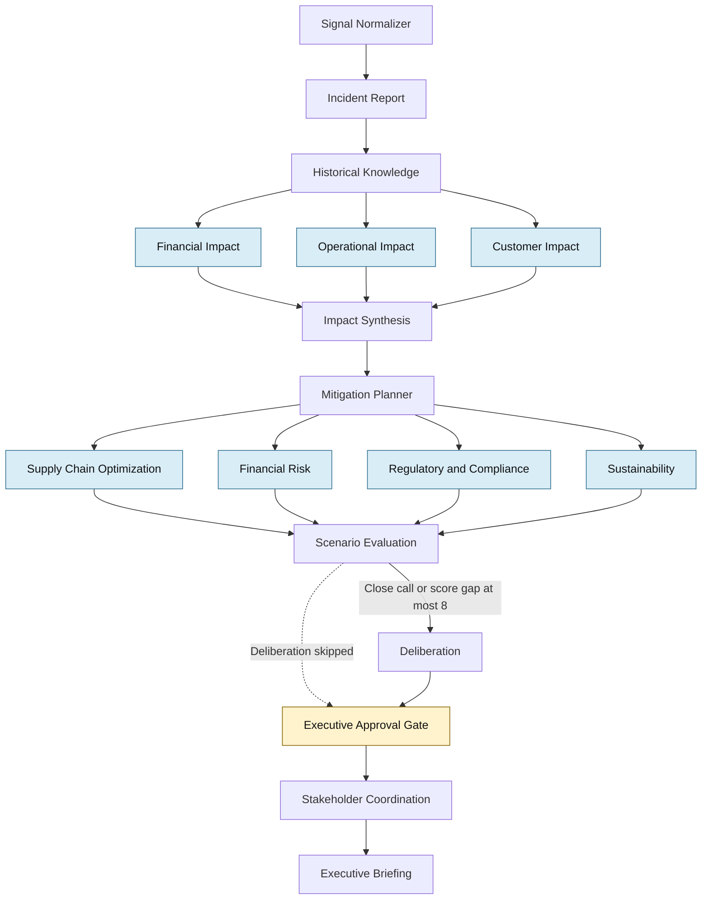
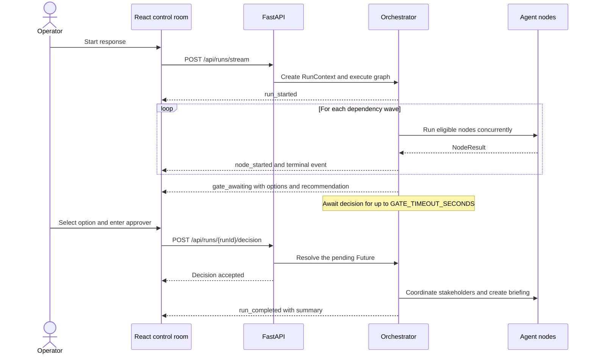
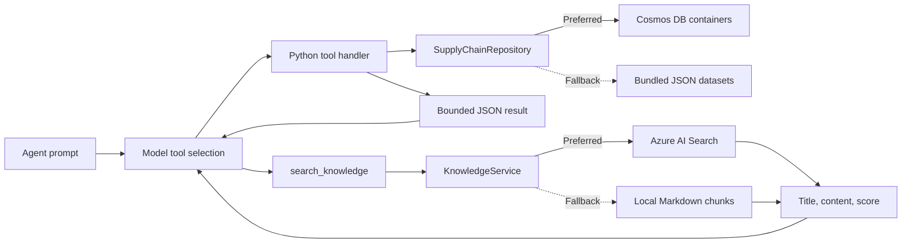
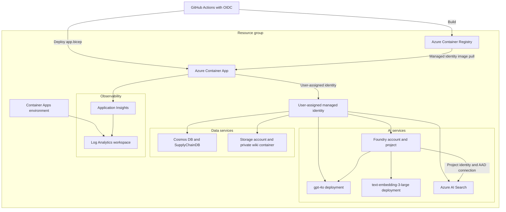

## Purpose and scope

Supply Disruption Response is a reference implementation for coordinating an enterprise
response to a critical ingredient shortage. It combines a React control room, a FastAPI
orchestration service, 17 workflow nodes, Microsoft Foundry prompt agents, local model-backed
agents, Agent-to-Agent (A2A) calls, grounded enterprise data, and an executive approval gate.

This guide is the technical source of truth for developers, architects, operators, security
reviewers, and demonstration owners. It covers the implemented application and its Azure
deployment. The broader business scenario is described in [Supply Disruption Response Use
Case](./use%20case.md).

> [!IMPORTANT]
> The workflow produces decision support, not an autonomous business decision. A named human
> approver can accept or override the recommendation. The current default also auto-approves
> the recommended option after a 15-minute gate timeout. Review that policy before production
> use.

## Scenario

The bundled scenario models a force majeure event at supplier `SUP-EU-014` for
high-methoxyl pectin (`ING-PEC-450`). The signal identifies products, plants, and markets at
risk within a projected depletion window. The workflow then:

1. Normalizes the incoming signal and creates an incident view.
2. Retrieves historical incidents and response guidance.
3. Runs financial, operational, and customer impact assessments concurrently.
4. Produces four mitigation options.
5. Validates every option through supply chain, financial, regulatory, and sustainability
   specialists.
6. Scores the options and conditionally deliberates when the leading scores are close.
7. Suspends for an executive decision.
8. Converts the approved option into owned actions and an executive briefing.

## Architecture at a glance

The deployed container serves both the single-page application and the API. The API owns the
run registry and workflow scheduler. Agent nodes use one of four execution modes while sharing
the same contracts, model concurrency limit, domain tools, and run-scoped result model.



### Major components

| Component | Responsibility | Implementation |
| --------- | -------------- | -------------- |
| Control room | Starts runs, consumes events, renders the DAG, presents evidence, and records approval | React 18 and TypeScript in [`App.tsx`](../src/frontend/src/App.tsx) |
| API host | Exposes health, scenario, governance, run, decision, and A2A endpoints; serves the built UI | FastAPI in [`main.py`](../src/backend/app/main.py) |
| Orchestrator | Computes dependency waves, runs peers concurrently, emits events, and invokes the gate | [`engine.py`](../src/backend/app/orchestration/engine.py) |
| Workflow | Builds prompts, defines routing, normalizes signals, and implements approval timeout behavior | [`workflow.py`](../src/backend/app/orchestration/workflow.py) |
| Agent registry | Defines 17 nodes, hosting modes, tools, prompts, output contracts, and graph edges | [`definitions.py`](../src/backend/app/agents/definitions.py) |
| Agent runner | Dispatches Foundry, local, and A2A execution and returns a common `NodeResult` | [`runner.py`](../src/backend/app/agents/runner.py) |
| Model client | Calls Azure OpenAI, executes function tools, limits concurrency, and collects usage | [`llm.py`](../src/backend/app/llm.py) |
| Domain data | Reads Cosmos DB and falls back to bundled JSON | [`data.py`](../src/backend/app/data.py) |
| Knowledge retrieval | Reads Azure AI Search and falls back to local Markdown keyword search | [`knowledge.py`](../src/backend/app/knowledge.py) |
| Telemetry | Instruments FastAPI, agents, Foundry calls, token usage, and Azure Monitor export | [`telemetry.py`](../src/backend/app/telemetry.py) |
| Azure infrastructure | Provisions identity, data, AI, registry, compute environment, and observability | [`main.bicep`](../infra/main.bicep) and [`app.bicep`](../infra/app.bicep) |

## Orchestration design

### Workflow graph

The graph is executed in dependency waves. Nodes within the same wave run concurrently.
Fan-in nodes start after every declared dependency has produced a terminal result. A terminal
result can be completed, failed, or skipped; downstream synthesis prompts identify missing
assessments explicitly.



The dashed edge is logical rather than a literal edge in `EDGES`. When deliberation is skipped,
the skipped node still records a terminal result, allowing the executive gate to run in the
next dependency wave.

### Execution waves

| Wave | Nodes | Pattern |
| ---- | ----- | ------- |
| 0 | `signal_normalizer` | Deterministic entry point |
| 1 | `incident_report` | Sequential situational analysis |
| 2 | `historical_knowledge` | Sequential retrieval |
| 3 | `financial_impact`, `operational_impact`, `customer_impact` | Concurrent fan-out |
| 4 | `impact_synthesis` | Fan-in |
| 5 | `mitigation_planner` | Option generation |
| 6 | `supply_chain_optimization`, `financial_risk`, `regulatory_compliance`, `sustainability` | Concurrent fan-out |
| 7 | `scenario_evaluation` | Fan-in and ranking |
| 8 | `deliberation` | Conditional route |
| 9 | `executive_gate` | Human-in-the-loop suspension |
| 10 | `stakeholder_coordination` | Execution planning |
| 11 | `executive_briefing` | Final synthesis |

### Conditional deliberation

Deliberation runs only when `ENABLE_DELIBERATION` is true and either condition is met:

* The scenario evaluator returns `closeCall: true`.
* The difference between the two highest `totalScore` values is at most 8 points.

Otherwise, the node emits `node_skipped` with `condition not met`. The approval gate still
runs and uses the scenario evaluator's recommendation.

### Human approval sequence



If no decision arrives before `GATE_TIMEOUT_SECONDS`, the gate selects the recommended option,
sets `autoApproved` to `true`, and identifies the approver as `Auto-approved (gate timeout)`.
The default timeout is 900 seconds.

### Failure and cancellation behavior

* An exception inside an agent becomes a failed `NodeResult` and a `node_failed` event.
* One failed node does not abort the graph. Join prompts label unavailable assessments and use
  the evidence that remains.
* A node is skipped when its condition is false or a declared dependency never produced a
  result.
* The browser uses an `AbortController` to cancel an open stream when the user resets the run.
* Disconnecting the stream cancels the orchestration task and releases its in-memory registry
  entry.
* An unexpected orchestration exception produces `run_failed`.

## Agent catalog

The application presents every workflow node as an agent in the graph. Two nodes are
deterministic system functions; the remaining 15 invoke model-backed execution.

| Node | Display name | Mode | Primary responsibility |
| ---- | ------------ | ---- | ---------------------- |
| `signal_normalizer` | Signal Normalizer | System | Normalize the signal and assign initial severity |
| `incident_report` | Incident Report | Foundry | Establish products, plants, markets, inventory, and root cause |
| `historical_knowledge` | Historical Knowledge | Foundry | Retrieve precedents, mitigations, and lessons learned |
| `financial_impact` | Financial Impact | A2A | Quantify revenue, margin, logistics cost, and penalty exposure |
| `operational_impact` | Operational Impact | A2A | Assess lines, schedules, units, reallocation, and logistics |
| `customer_impact` | Customer Impact | A2A | Identify accounts, commitments, and promotions at risk |
| `impact_synthesis` | Impact Synthesis | Local | Consolidate impact assessments and record gaps |
| `mitigation_planner` | Mitigation Planner | Local | Generate supplier, inventory, schedule, and prioritization options |
| `supply_chain_optimization` | Supply Chain Optimization | Foundry | Validate physical feasibility, lead time, and capacity |
| `financial_risk` | Financial Risk | Foundry | Validate net position, cost confidence, and downside |
| `regulatory_compliance` | Regulatory and Compliance | Foundry | Validate EU rules, qualification, certification, and labels |
| `sustainability` | Sustainability | Foundry | Validate emissions and responsible sourcing alignment |
| `scenario_evaluation` | Scenario Evaluation | Local | Score five dimensions and rank all four options |
| `deliberation` | Deliberation | Local | Debate close leaders from four business perspectives |
| `executive_gate` | Executive Approval Gate | System | Suspend the run until approval or timeout |
| `stakeholder_coordination` | Stakeholder Coordination | A2A | Assign actions, approvals, meetings, risks, and KPIs |
| `executive_briefing` | Executive Briefing | Foundry | Produce the final decision record and board-level summary |

### Hosting modes

Foundry mode contains seven stored, versioned prompt agents. Each definition includes its
instructions, Python function tool schemas, optional Azure AI Search grounding, and optional
external MCP tool. The runner invokes these agents through the Foundry Responses API. If a
stored agent cannot serve the request, the same instructions and Python function tools run
through the shared Azure OpenAI client, and `_executionNote` records
`foundry_fallback_to_shared_model`. Native Foundry Search grounding and an attached MCP tool are
not available on that fallback path.

Local mode contains four in-process agents. “Local” describes where the orchestration code and
tools execute; these nodes still call the configured Azure OpenAI deployment.

A2A mode contains four agents. The runner sends a JSON-RPC `message/send` request over HTTP to
this service's own `/a2a/{agentName}` endpoint. The endpoint invokes the shared model and local
function handlers, then returns text, usage, and tool-call evidence.

System mode contains the signal normalizer and approval gate. These nodes do not call a model.

## Data and grounding

### Domain data path

Fourteen Python function tools expose bounded supply-chain queries. The tools cover ingredients,
suppliers, inventory, products, plants, production schedules, customers, commitments,
promotions, historical incidents, playbooks, stakeholders, and knowledge retrieval.



The repository loads 13 reference containers from Cosmos DB. If the endpoint is absent,
startup probing fails, a query returns no rows, or a read fails, it falls back to the matching
JSON file represented by [`signals.json`](../data/signals.json) and the neighboring datasets.
Results are cached in memory for the process lifetime.

The Bicep template also creates `runs` and `actions` containers. The current application does
not write orchestration state to them. Active run state is held in `RunRegistry` and is released
when the SSE request ends. Run lookup is therefore available only while the stream is active,
and state does not survive process or replica changes.

### Knowledge path

The knowledge corpus contains eight Markdown documents:

* 2024 pectin shortage postmortem
* Customer allocation policy
* EU food additive regulatory guide
* Inventory reallocation playbook
* Product substitution formulation
* Production rescheduling guide
* Supplier qualification procedure
* Sustainability sourcing standards

[`scripts/seed.py`](../scripts/seed.py) chunks these files into approximately 1,400-character
segments, generates 3,072-dimensional embeddings with `text-embedding-3-large`, and uploads
them to the `disruption-knowledge` index. Runtime `KnowledgeService` queries Azure AI Search
with text search. If Search is absent, empty, or unavailable, it scores the same local chunks by
keyword occurrence.

Foundry agents that declare `search_knowledge` can additionally receive a native Azure AI
Search tool through the project connection named `knowledge-search`.

### Grounding rules

Every model-backed node receives common instructions to:

* Ground claims in tool-returned data.
* State when evidence is unavailable rather than inventing figures.
* Treat monetary values as EUR.
* Return one JSON object matching the node-specific output contract.

Python function-tool arguments and results are retained in each `NodeResult`, truncated to keep
the event payload bounded. The current Foundry result collector does not retain native Azure AI
Search or MCP activity in this list. The UI exposes the collected Python calls in the agent
detail panel.

## API and event contracts

### Core endpoints

| Method | Route | Purpose |
| ------ | ----- | ------- |
| `GET` | `/api/health` | Report model configuration, startup-selected data sources, and node count |
| `GET` | `/api/scenario` | Return the reference signal, graph, and agent metadata |
| `POST` | `/api/runs/stream` | Start a run and stream Server-Sent Events |
| `POST` | `/api/runs/{run_id}/decision` | Resolve a run waiting at the executive gate |
| `GET` | `/api/runs/{run_id}` | Return an active run summary |
| `GET` | `/api/governance` | Return agent modes, platform flags, and Foundry provisioning status |
| `GET` | `/api/foundry/agents` | Return Foundry agent provisioning status |
| `POST` | `/api/foundry/agents/provision` | Create or reuse all Foundry-mode agent versions |
| `GET` | `/a2a/{agent_name}/.well-known/agent-card.json` | Return an A2A v0.2.0 agent card |
| `POST` | `/a2a/{agent_name}` | Invoke `message/send` through JSON-RPC 2.0 |

The application currently allows all CORS origins, methods, and headers. The API has no
application-level authentication or authorization middleware. Azure RBAC protects calls from
the service to its dependencies, but it does not protect the public HTTP API.

### Start a run

An empty object starts the bundled reference scenario:

```http
POST /api/runs/stream HTTP/1.1
Accept: text/event-stream
Content-Type: application/json

{}
```

A caller can override the signal:

```json
{
  "signal": {
    "id": "INC-EXAMPLE-001",
    "ingredientId": "ING-PEC-450",
    "ingredientName": "High-Methoxyl Pectin",
    "supplierId": "SUP-EU-014",
    "confidence": 0.95,
    "depletionDaysMin": 12,
    "depletionDaysMax": 18,
    "impactedSkus": ["SKU-YOG-001"],
    "affectedRegions": ["FR", "DE", "BE"],
    "affectedPlants": ["PLANT-FR-01"],
    "source": "databricks-stub",
    "detectedAt": "2026-09-04T10:30:00Z"
  }
}
```

### SSE event types

Each frame is a JSON object prefixed with `data:` and terminated by a blank line.

| Event | Key payload | Meaning |
| ----- | ----------- | ------- |
| `run_started` | `runId`, `incidentId`, `graph`, `signal` | Run registration completed |
| `node_started` | `nodeId`, `agentName`, `hostingMode` | Node execution began |
| `node_completed` | `nodeId`, `result` | Node returned a completed result |
| `node_failed` | `nodeId`, `error`, `result` | Node returned a failed result |
| `node_skipped` | `nodeId`, `reason` | Condition or dependency prevented execution |
| `gate_awaiting` | `nodeId`, `runId`, `options`, `recommendation` | Approval input is required |
| `run_completed` | `summary` | All waves reached terminal state |
| `run_failed` | `error` | The orchestration driver failed |
| `log` | Implementation-defined log fields | Optional diagnostic event |

A `NodeResult` includes `nodeId`, `agentName`, `hostingMode`, `state`, input, narrative,
structured JSON, tool calls, error, duration, prompt tokens, completion tokens, and total tokens.

### Submit a decision

```http
POST /api/runs/run-0123456789ab/decision HTTP/1.1
Content-Type: application/json

{
  "optionId": "B",
  "approver": "Chief Supply Chain Officer",
  "notes": "Proceed with inventory reallocation and daily review."
}
```

`optionId` is required. The current endpoint verifies that the run is waiting, but it does not
validate that the supplied option exists in the gate's option set.

## Frontend architecture

[`App.tsx`](../src/frontend/src/App.tsx) owns the run state through React hooks and passes data
to focused presentation components. There is no external state-management library.

The initial load requests `/api/health` and `/api/scenario`. If the backend is unavailable, the
page uses a bundled graph and sample signal to keep the control room usable. That fallback graph
is illustrative and is not the authoritative topology or hosting-mode registry. Starting a run
opens the POST-based SSE stream through a custom `ReadableStream` parser because browser
`EventSource` supports only GET. Events update node state, results, metrics, logs, and gate UI.

The control room contains:

* A header with backend status, elapsed time, node progress, token count, run controls, and
  theme selection
* An incident panel for the source signal and depletion window
* An SVG workflow graph with selectable nodes and state overlays
* An agent detail dialog with prompts, structured output, tools, tokens, timing, and errors
* An impact dashboard for financial, operational, and customer exposure
* A scenario comparison view across five scoring dimensions
* An approval view for option selection, approver identity, and notes
* A bounded, pausable event log
* A governance table for execution mode, state, duration, token usage, and estimated cost

The Vite development server listens on port 5173 and proxies `/api` to port 8000. The
production image builds the UI into `app/static`; FastAPI then serves the UI and API on port
8000 from one container.

## Azure deployment architecture

The core Bicep deployment creates shared Azure resources. A separate application deployment
updates the container image and runtime configuration without recreating the data and AI
services.



### Provisioned resources

| Resource | Configuration |
| -------- | ------------- |
| User-assigned managed identity | Runtime identity selected through `AZURE_CLIENT_ID` |
| Azure Container Registry | Basic SKU, admin user disabled |
| Container Apps environment | Log Analytics integration |
| Azure Container App | External HTTPS ingress, port 8000, 1 vCPU, 2 GiB, one to two replicas |
| Foundry account | `AIServices` S0 with project management and system identity |
| Foundry project | `sdr-project` with an Azure AI Search AAD connection |
| Chat deployment | `gpt-4o`, version `2024-11-20`, Global Standard, capacity 100 |
| Embedding deployment | `text-embedding-3-large`, version 1, Standard, capacity 50 |
| Azure AI Search | Basic, one partition, one replica, free semantic tier enabled |
| Cosmos DB | Session consistency, one non-zone-redundant region, 400 RU/s shared database throughput |
| Storage account | Standard LRS, TLS 1.2, HTTPS only, public blob access disabled |
| Blob container | Private `disruption-wiki` container |
| Application Insights | Workspace-based application telemetry |
| Log Analytics | PerGB2018, 30-day retention |

Resource names use the `sdr` prefix and a deterministic `uniqueString` suffix, except the
container app (`sdr-app`) and Foundry project (`sdr-project`). The checked-in parameter file
selects Sweden Central.

### Cosmos DB containers

The `SupplyChainDB` database provisions 15 containers:

| Container | Partition key | Current use |
| --------- | ------------- | ----------- |
| `ingredients` | `/category` | Reference data |
| `suppliers` | `/country` | Reference data |
| `plants` | `/country` | Reference data |
| `products` | `/brand` | Reference data |
| `inventory` | `/plantId` | Reference data |
| `customers` | `/region` | Reference data |
| `commitments` | `/customerId` | Reference data |
| `promotions` | `/region` | Reference data |
| `productionSchedule` | `/plantId` | Reference data |
| `pastDisruptions` | `/ingredientId` | Reference data |
| `playbooks` | `/category` | Reference data |
| `stakeholders` | `/function` | Reference data |
| `signals` | `/ingredientId` | Reference scenario data |
| `runs` | `/runId` | Provisioned for future persistence |
| `actions` | `/runId` | Provisioned for future persistence |

## Identity and security

### Runtime authentication

Application code uses `DefaultAzureCredential` for Azure OpenAI, Foundry, Cosmos DB, and Azure
AI Search. Blob Storage and its endpoint are provisioned for knowledge content, but the current
runtime does not create a Blob client. No service keys are read by the domain code.
`AZURE_CLIENT_ID` selects the user-assigned identity in Container Apps.

The identity receives:

* `AcrPull` on the container registry
* `Azure AI Developer`, `Cognitive Services OpenAI User`, and `Cognitive Services User` on the
  Foundry account
* `Search Index Data Contributor` and `Search Service Contributor` on Azure AI Search
* `Storage Blob Data Contributor` on the storage account
* Cosmos DB built-in data contributor on the Cosmos account

The Foundry project's system identity separately receives `Search Index Data Reader` and
`Search Service Contributor` so hosted knowledge tools can query the index.

GitHub Actions authenticates to Azure through OpenID Connect. Repository secrets contain the
client, tenant, and subscription identifiers, not a client secret.

### Current security posture

The infrastructure enforces HTTPS on the public Container App, TLS 1.2 on Storage, private
blob access, and identity-based ACR pulls. Prompt and completion content recording is disabled
by default because it can contain business data.

Application Insights is the exception to the data-plane RBAC pattern: the Container App receives
the workspace-based Application Insights connection string and passes it to Azure Monitor
OpenTelemetry. The connection string is not an application secret, but it is not managed-identity
authentication.

The current templates also leave several production hardening tasks open:

* Container Apps ingress is public and the API has no caller authentication.
* CORS allows every origin, method, and header.
* Foundry, Cosmos DB, and Azure AI Search expose public service endpoints.
* Azure AI Search and Foundry permit local authentication in addition to Microsoft Entra ID.
* The A2A endpoint accepts any known agent name without caller authorization.
* The decision endpoint does not enforce approver roles or validate option membership.
* No virtual network, private endpoint, web application firewall, or API gateway is provisioned.

For production use, add Microsoft Entra ID authentication at ingress, narrow CORS, validate
decision authorization and option IDs, disable local authentication where supported, and
evaluate private networking based on organizational policy.

## Observability and governance

When `APPLICATIONINSIGHTS_CONNECTION_STRING` is set, Azure Monitor OpenTelemetry exports
FastAPI and custom agent traces to Application Insights. Foundry instrumentation adds generative
AI spans. Each agent span records its name, hosting mode, node ID, total tokens, and error when
applicable.

Prompt and completion bodies are recorded only when `GEN_AI_CONTENT_RECORDING=true`. Keep this
disabled unless data classification, retention, and access controls explicitly permit content
capture.

The UI governance view shows per-node mode, state, duration, tokens, and estimated model cost.
The `/api/governance` endpoint exposes configured model names, feature flags, telemetry status,
and Foundry provisioning status. These are operational views, not a durable compliance audit
log, because run records are not persisted.

The health endpoint always reports the API process as `healthy` after initialization and
identifies whether startup selected Azure or local sources for data and knowledge. These labels
do not change when a later query falls back locally. The endpoint does not fail readiness when
Foundry provisioning or an Azure dependency is degraded.

## Configuration reference

| Variable | Default | Purpose |
| -------- | ------- | ------- |
| `AZURE_CLIENT_ID` | None | Select the user-assigned managed identity |
| `AZURE_AI_PROJECT_ENDPOINT` | Empty | Address the Foundry project and enable hosted agents |
| `AZURE_OPENAI_ENDPOINT` | Empty | Enable shared model and embedding calls |
| `AZURE_OPENAI_API_VERSION` | `2024-10-21` | Select the Azure OpenAI API version |
| `MODEL_DEPLOYMENT_NAME` | `gpt-4o` | Select the chat model deployment |
| `MODEL_MAX_CONCURRENCY` | `6` | Bound concurrent model requests across fan-out waves |
| `EMBEDDING_DEPLOYMENT_NAME` | `text-embedding-3-large` | Select the embedding deployment for seeding |
| `COSMOS_ENDPOINT` | Empty | Enable Cosmos DB as the preferred data source |
| `COSMOS_DATABASE` | `SupplyChainDB` | Select the Cosmos DB database |
| `SEARCH_ENDPOINT` | Empty | Enable Azure AI Search as the preferred knowledge source |
| `SEARCH_INDEX_NAME` | `disruption-knowledge` | Select the knowledge index |
| `STORAGE_BLOB_ENDPOINT` | Empty | Identify the storage endpoint reserved for knowledge content |
| `KNOWLEDGE_CONTAINER` | `disruption-wiki` | Identify the knowledge blob container |
| `APPLICATIONINSIGHTS_CONNECTION_STRING` | Empty | Enable Application Insights export |
| `ENABLE_DELIBERATION` | `true` | Enable close-call deliberation routing |
| `ENABLE_FOUNDRY_HOSTED_AGENTS` | `true` | Prefer stored Foundry agents |
| `PROVISION_FOUNDRY_AGENTS` | `true` | Provision Foundry agents during startup |
| `FOUNDRY_AGENT_PREFIX` | `sdr` | Prefix stored Foundry agent names |
| `FOUNDRY_MAX_TOOL_ROUNDS` | `4` | Bound Foundry function-call loops |
| `MCP_SERVER_LABEL` | Empty | Label an optional external MCP server |
| `MCP_SERVER_URL` | Empty | Attach an optional MCP server to hosted agents |
| `ENABLE_FOUNDRY_KNOWLEDGE` | `true` | Attach native Search grounding where applicable |
| `KNOWLEDGE_CONNECTION_NAME` | `knowledge-search` | Select the Foundry project connection |
| `KNOWLEDGE_QUERY_TYPE` | `simple` | Select the native knowledge query type |
| `KNOWLEDGE_TOP_K` | `5` | Limit native knowledge results |
| `GEN_AI_CONTENT_RECORDING` | `false` | Opt in to prompt and completion trace content |
| `SELF_BASE_URL` | `http://127.0.0.1:8000` | Address the in-process A2A HTTP surface |
| `AGENT_TIMEOUT_SECONDS` | `180` | Set model and A2A request timeout |
| `GATE_TIMEOUT_SECONDS` | `900` | Set the executive decision timeout |
| `PORT` | `8000` | Set the FastAPI listen port |

Container Apps intentionally uses the loopback `SELF_BASE_URL` because A2A agents are hosted
by the same container. A public URL is not required for this deployment topology.

## Local development

### Prerequisites

* Python 3.12
* Node.js 20 and npm
* An Azure identity available through `DefaultAzureCredential` for live Azure dependencies
* Provisioned Azure endpoints for full model-backed execution

The application can display its topology and load local data without Cosmos DB or Azure AI
Search. A complete workflow still requires `AZURE_OPENAI_ENDPOINT`; otherwise model-backed
nodes fail and the workflow records those failures.

### Install dependencies

Create a virtual environment and install the backend packages:

```powershell
python -m venv .venv
.\.venv\Scripts\python.exe -m pip install -r src/backend/requirements.txt
```

Install the frontend packages:

```powershell
Set-Location src/frontend
npm install
Set-Location ../..
```

The frontend `.npmrc` and the workstation package-manager configuration use the approved
organization feeds. The Docker runtime stage does not currently copy a repository-controlled
pip configuration before installing Python packages. Correct that gap before rebuilding the
production image in an environment that does not inject the approved feed automatically.

### Run the application

Start FastAPI from the backend directory:

```powershell
Set-Location src/backend
..\..\.venv\Scripts\python.exe -m uvicorn app.main:app --port 8000
```

In another terminal, start Vite:

```powershell
Set-Location src/frontend
npm run dev
```

Open `http://localhost:5173`. Vite proxies API traffic to `http://localhost:8000` and disables
proxy buffering for the event stream.

## Provisioning and deployment

### Provision core resources

Create the resource group, then deploy the long-lived infrastructure:

```powershell
az group create --name rg-supply-disruption --location swedencentral
az deployment group create `
    --resource-group rg-supply-disruption `
    --name sdr-core `
    --template-file infra/main.bicep `
    --parameters infra/main.parameters.json
```

The deployment outputs supply endpoints and resource IDs to the seeding and application
deployment steps.

### Seed domain and knowledge data

Set the core deployment outputs in the environment, authenticate with Azure CLI, and run:

```powershell
.\.venv\Scripts\python.exe scripts/seed.py
```

The script idempotently upserts 13 JSON datasets into Cosmos DB, creates or updates the Search
index, embeds the knowledge corpus, and uploads the chunks.

### Build and deploy the application

```powershell
pwsh ./scripts/deploy.ps1
```

The script reads the `sdr-core` outputs, builds the multi-stage image in ACR, and deploys
[`infra/app.bicep`](../infra/app.bicep). The image build compiles the React UI with Node 20,
then installs the Python backend into a Python 3.12 runtime image.

### CI/CD

Pushes to `main` trigger [`.github/workflows/deploy.yml`](../.github/workflows/deploy.yml), except
documentation-only and license changes. The workflow:

1. Authenticates to Azure through GitHub OIDC.
2. Reads outputs from the `sdr-core` resource-group deployment.
3. runs `az acr build` with an immutable timestamp and commit tag plus `latest`.
4. deploys the tagged image through `infra/app.bicep`.
5. polls `/api/health` up to 30 times at 10-second intervals.
6. writes the commit, image, and application URL to the workflow summary.

Core infrastructure is not redeployed by this workflow. Apply changes to `infra/main.bicep`
through a separate reviewed infrastructure deployment.

## Verification and operations

### Build checks

Validate the frontend type contracts and production bundle:

```powershell
Set-Location src/frontend
npm run build
```

Compile the Python source without calling Azure:

```powershell
Set-Location ../..
.\.venv\Scripts\python.exe -m compileall src/backend/app scripts
```

### End-to-end workflow check

With the application running and Azure OpenAI configured, run:

```powershell
.\.venv\Scripts\python.exe scripts/verify.py http://127.0.0.1:8000
```

The verifier checks health, opens the SSE stream, submits the recommended option at the gate,
and fails if the run does not complete or any node reports failure. Pass a deployed base URL to
validate an Azure revision.

### Operational signals

Monitor these signals together:

* Container App revision health, replica count, restarts, CPU, memory, and HTTP failures
* `/api/health` startup values for `openAiConfigured`, `dataSource`, and `knowledgeSource`
* Application Insights request failures, agent spans, latency, token usage, and tool errors
* Foundry provisioning status and per-agent errors from `/api/governance`
* `node_failed`, `node_skipped`, `run_failed`, and gate timeout outcomes in streamed runs
* Azure OpenAI quota and throttling during the three-agent and four-agent fan-out waves
* Search document count and Cosmos DB throttling after data changes

### Troubleshooting

#### Model-backed nodes fail immediately

Check `AZURE_OPENAI_ENDPOINT`, `MODEL_DEPLOYMENT_NAME`, the selected identity, and the identity's
OpenAI role. `/api/health` reports `openAiConfigured: false` when the endpoint is absent.

#### Foundry agents do not appear or use fallback execution

Check `AZURE_AI_PROJECT_ENDPOINT`, `ENABLE_FOUNDRY_HOSTED_AGENTS`, startup logs, and
`/api/foundry/agents`. Trigger `POST /api/foundry/agents/provision` after correcting access.
Results with `_executionNote: foundry_fallback_to_shared_model` completed through the shared
model rather than the stored agent.

#### A2A nodes fail

Check that `SELF_BASE_URL` resolves from inside the running process and that the FastAPI server
is listening on the same port. The standard Container Apps deployment intentionally uses
`http://127.0.0.1:8000`.

#### Data or knowledge selects a local source at startup

Confirm the corresponding endpoint variable, managed identity role, and resource availability.
For Search, also verify that the index contains documents. Startup fallback is visible in health
metadata rather than as a readiness failure. Later query-level fallback appears in application
logs but does not update the health source fields.

#### The run appears stuck

Inspect the latest event. `gate_awaiting` means the run is intentionally suspended. Submit a
decision or wait for the configured timeout. A browser disconnect cancels the run; it cannot be
resumed because the registry is in memory.

#### A decision returns 404

The run is no longer registered, is not currently waiting at the gate, or another decision has
already resolved it. Start a new run if the SSE connection was closed.

## Databricks and external integration status

The repository includes a Databricks seed script, SQL schema, and a separate Foundry agent
provisioner for a Genie-backed data analyst. These assets are optional and are not connected to
the active 17-node workflow. The current signal normalizer consumes the bundled signal or a
caller-supplied HTTP payload and labels the default source `databricks-stub`.

[`scripts/provision_databricks_agent.py`](../scripts/provision_databricks_agent.py) can create a
separate `lactavia-data-analyst` Foundry agent when Databricks host, Genie space, and connection
settings are supplied. Integrating that agent into the graph requires an explicit contract and
workflow change.

An optional external MCP server can be attached to every stored Foundry agent through
`MCP_SERVER_URL`. The current configuration requests no per-call approval from that MCP tool.
Apply endpoint trust, authentication, tool allowlisting, and approval policy before enabling it
with production data.

## Known limitations and production backlog

* Run and action persistence is not implemented despite the provisioned Cosmos containers.
* The in-memory run registry is not replica-safe and cannot resume after restart or disconnect.
* Public API authentication, authorization, rate limiting, and tenant isolation are absent.
* The approval endpoint does not validate the selected option or approver authority.
* Auto-approval on timeout may not satisfy enterprise control requirements.
* Public data-plane endpoints and local authentication remain enabled on several Azure services.
* Cosmos DB is single-region and non-zone-redundant.
* Azure AI Search uses one replica and one partition.
* Container Apps scales from one to two replicas without a custom scale rule.
* The health endpoint does not represent dependency readiness, Foundry provisioning failure, or
  query-level fallback after startup.
* Local knowledge fallback is lexical rather than vector or semantic retrieval.
* Tool and prompt payloads are truncated in results, which limits forensic reconstruction.
* The event stream has no durable replay or reconnect cursor.
* Databricks Genie and Copilot Studio are extension paths, not active workflow dependencies.
* No automated backend unit or integration test suite is checked into the repository; the
  primary runtime validation is `scripts/verify.py`.
* The Docker Python stage does not carry a repository-controlled approved pip feed
  configuration, so dependency provenance depends on the build environment.

## Repository map

```text
SupplyDisruptionResponse/
|-- .github/workflows/deploy.yml       GitHub OIDC deployment workflow
|-- data/                              Bundled domain data and knowledge corpus
|-- databricks/                        Optional Databricks schema and setup notes
|-- docs/                              Use-case and technical documentation
|-- infra/main.bicep                   Long-lived Azure resources and RBAC
|-- infra/app.bicep                    Container App revision and runtime settings
|-- scripts/seed.py                    Cosmos DB and Azure AI Search seeding
|-- scripts/deploy.ps1                 ACR build and Container App deployment
|-- scripts/verify.py                  Full streamed-run verification
|-- src/backend/app/main.py            FastAPI, SSE, A2A, and static hosting
|-- src/backend/app/agents/            Agent registry, tools, Foundry, and runner
|-- src/backend/app/orchestration/     DAG engine and workflow definition
|-- src/frontend/src/                  React control-room application
`-- Dockerfile                         UI build and Python runtime image
```

## Source basis and review

This guide is grounded in the repository implementation as of 2026-09-04. Runtime behavior can
drift when code, infrastructure, or deployment settings change. Review this guide alongside
changes to agent definitions, contracts, workflow routing, APIs, Bicep, or deployment scripts.

This documentation was materially drafted with AI assistance and should receive human review
before it is used as an operational, security, or compliance authority.
